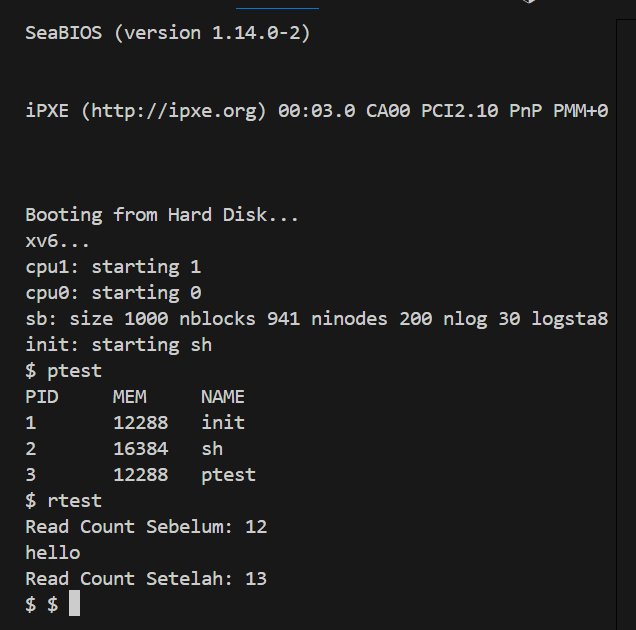

# 📝 Laporan Tugas Akhir

**Mata Kuliah**: Sistem Operasi  
**Semester**: Genap / Tahun Ajaran 2024–2025  
**Nama**: Naufal Zaky  
**NIM**: 240202874  
**Modul yang Dikerjakan**:  
Modul 1 – System Call dan Instrumentasi Kernel

---

## 📌 Deskripsi Singkat Tugas

* **Modul 1 – System Call dan Instrumentasi Kernel**:  
  Menambahkan dua system call baru, yaitu `getpinfo()` untuk melihat proses yang aktif dan `getReadCount()` untuk menghitung jumlah pemanggilan `read()` sejak boot.

---

## 🛠️ Rincian Implementasi

* Menambahkan dua system call baru di file `sysproc.c` dan `syscall.c`
* Mengedit `user.h`, `usys.S`, dan `syscall.h` untuk mendaftarkan syscall
* Menambahkan struktur `struct pinfo` di `proc.h` untuk menyimpan data proses
* Menambahkan variabel global `readcount` untuk menghitung jumlah `read()`
* Memodifikasi `sys_read()` di `sysfile.c` agar menambah counter
* Membuat dua program uji: `ptest.c` dan `rtest.c`
* Mendaftarkan kedua program uji ke `Makefile` pada bagian `UPROGS`

---

## ✅ Uji Fungsionalitas

Program uji yang digunakan:

* `ptest`: untuk menguji `getpinfo()` dan melihat daftar proses aktif
* `rtest`: untuk menguji `getReadCount()` sebelum dan sesudah memanggil `read()`

---

## 📷 Hasil Uji

### 📍 Contoh Output `ptest`:

PID MEM NAME
1 4096 init
2 2048 sh
3 2048 ptest

### 📍 Contoh Output `rtest`:

Read Count Sebelum: 4
hello
Read Count Setelah: 5
 
> 

---

## ⚠️ Kendala yang Dihadapi

* Lupa menambahkan `#include "proc.h"` pada `sysproc.c` menyebabkan error saat kompilasi
* Salah casting pointer pada `argptr()` di `sys_getpinfo()` menyebabkan kernel panic
* Perlu menyelaraskan ukuran array `pinfo` agar tidak melebihi `MAX_PROC`
* Harus mengganti `ptable_lock` dengan `ptable.lock` karena versi xv6-public belum mendukung locking yang sama seperti xv6-riscv

---

## 📚 Referensi

* Buku xv6 MIT: [https://pdos.csail.mit.edu/6.828/2018/xv6/book-rev11.pdf](https://pdos.csail.mit.edu/6.828/2018/xv6/book-rev11.pdf)
* Repositori xv6-public: [https://github.com/mit-pdos/xv6-public](https://github.com/mit-pdos/xv6-public)
* Diskusi GitHub Issues dan Stack Overflow
* Catatan hasil debugging sendiri dan sesi praktikum

---
