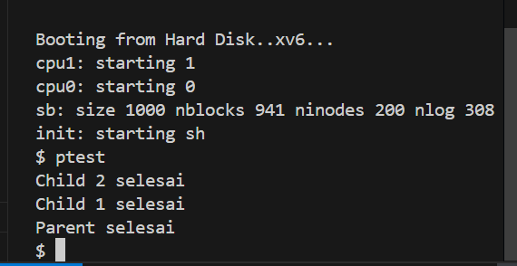

# 📝 Laporan Tugas Akhir

**Mata Kuliah**: Sistem Operasi  
**Semester**: Genap / Tahun Ajaran 2024–2025  
**Nama**: `Naufal Zaky`  
**NIM**: `240202874`  
**Modul yang Dikerjakan**:  
`Modul 2 – Penjadwalan CPU Lanjutan (Priority Scheduling Non-Preemptive)`

---

## 📌 Deskripsi Singkat Tugas

* **Modul 2 – Priority Scheduling Non-Preemptive**:  
  Mengubah algoritma penjadwalan proses default di `xv6-public` dari Round Robin menjadi Non-Preemptive Priority Scheduling. Proses dengan nilai prioritas numerik terkecil dijalankan terlebih dahulu. Ditambahkan juga syscall baru `set_priority()` untuk mengatur prioritas proses.

---

## 🛠️ Rincian Implementasi

* Menambahkan field `priority` di `struct proc` pada `proc.h`
* Inisialisasi default priority (`60`) pada `allocproc()` di `proc.c`
* Membuat system call `set_priority(int)` di `sysproc.c`
* Mendaftarkan syscall di `syscall.h`, `syscall.c`, `usys.S`, dan `user.h`
* Memodifikasi fungsi `scheduler()` di `proc.c` agar memilih proses RUNNABLE dengan prioritas tertinggi
* Membuat program uji `ptest.c` yang menjalankan dua proses anak dengan prioritas berbeda
* Menambahkan `ptest` ke `Makefile` untuk bisa dijalankan di shell xv6

---

## ✅ Uji Fungsionalitas

Program uji yang digunakan:

* `ptest`: untuk menguji eksekusi dua proses anak dengan prioritas berbeda dan memastikan proses dengan prioritas lebih tinggi selesai lebih dulu

---

## 📷 Hasil Uji

### 📍 Contoh Output `ptest`:

Child 2 selesai
Child 1 selesai
Parent selesai

> Keterangan:  
> `Child 2` memiliki prioritas lebih tinggi (angka lebih kecil), maka selesai lebih dulu meskipun dipanggil setelah `Child 1`.

> 

---

## ⚠️ Kendala yang Dihadapi

* Salah menulis logika pembanding prioritas menyebabkan semua proses dianggap sama prioritas
* Awalnya lupa menambahkan `set_priority` ke `usys.S` sehingga syscall tidak dikenali
* Scheduler sempat tetap berjalan Round Robin karena tidak semua kondisi pada `scheduler()` dimodifikasi dengan benar
* Kesalahan logika `if (highest == 0 || p->priority < highest->priority)` sempat menggunakan `>` bukan `<`

---

## 📚 Referensi

* Buku xv6 MIT: [https://pdos.csail.mit.edu/6.828/2018/xv6/book-rev11.pdf](https://pdos.csail.mit.edu/6.828/2018/xv6/book-rev11.pdf)
* Repositori xv6-public: [https://github.com/mit-pdos/xv6-public](https://github.com/mit-pdos/xv6-public)
* Stack Overflow, GitHub Issues, dan diskusi praktikum
* Hasil debugging mandiri pada file `proc.c` dan `sysproc.c`

---
