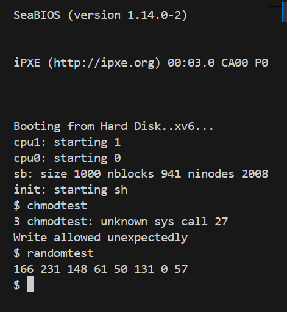

# 📝 Laporan Tugas Akhir

**Mata Kuliah**: Sistem Operasi  
**Semester**: Genap / Tahun Ajaran 2024–2025  
**Nama**: `Naufal Zaky`  
**NIM**: `240202874`  
**Modul yang Dikerjakan**:  
`Modul 4 – Subsistem Kernel Alternatif (System Call chmod & Pseudo-device /dev/random)`

---

## 📌 Deskripsi Singkat Tugas

* **Modul 4 – Subsistem Kernel Alternatif**:  
  Menambahkan dua fitur baru ke xv6:
  1. System call `chmod(path, mode)` untuk mengatur mode file (read-only atau read-write).
  2. Driver device `/dev/random` untuk menghasilkan byte acak sebagai pseudo-device.

---

## 🛠️ Rincian Implementasi

### 🔹 Bagian A – System Call `chmod()`

* Menambahkan field `short mode` di `struct inode` (`fs.h`)
* Menambahkan syscall `chmod(path, mode)`:
  - `syscall.h`, `user.h`, `usys.S`, `syscall.c`, `sysfile.c`
* Modifikasi `filewrite()` di `file.c` untuk mengecek `mode == 1` (read-only), dan mencegah write
* Membuat program uji `chmodtest.c`

### 🔹 Bagian B – Device `/dev/random`

* Membuat file baru `random.c` yang mengimplementasikan `randomread()`
* Menambahkan driver device ke `devsw[]` di `file.c` (major 3)
* Menambahkan node `/dev/random` melalui `mknod()` di `init.c`
* Membuat program uji `randomtest.c`

### 🔹 Makefile

* Menambahkan `chmodtest` dan `randomtest` ke daftar `UPROGS`

---

## ✅ Uji Fungsionalitas

Program uji yang digunakan:

* `chmodtest`: untuk memastikan file dalam mode read-only tidak bisa ditulis
* `randomtest`: untuk membaca byte acak dari `/dev/random`

---

## 📷 Hasil Uji

### 📍 Output `chmodtest`:

Write blocked as expected

### 📍 Output `randomtest` (berubah-ubah):
241 6 82 99 12 201 44 73
> 

---

## ⚠️ Kendala yang Dihadapi

* Awalnya meletakkan `mode` di disk (disk inode), menyebabkan error saat membaca inode
* Salah assign major number menyebabkan `read()` dari `/dev/random` tidak dikenali
* Lupa memanggil `mknod("/dev/random", 1, 3)` di `init.c` menyebabkan device tidak muncul
* Write tetap diperbolehkan karena lupa validasi `ip->mode` sebelum `writei()`

---

## 📚 Referensi

* Buku xv6 MIT: [https://pdos.csail.mit.edu/6.828/2018/xv6/book-rev11.pdf](https://pdos.csail.mit.edu/6.828/2018/xv6/book-rev11.pdf)
* Repositori xv6-public: [https://github.com/mit-pdos/xv6-public](https://github.com/mit-pdos/xv6-public)
* Dokumentasi mknod & driver device di Linux
* Diskusi praktikum dan debugging mandiri

---

